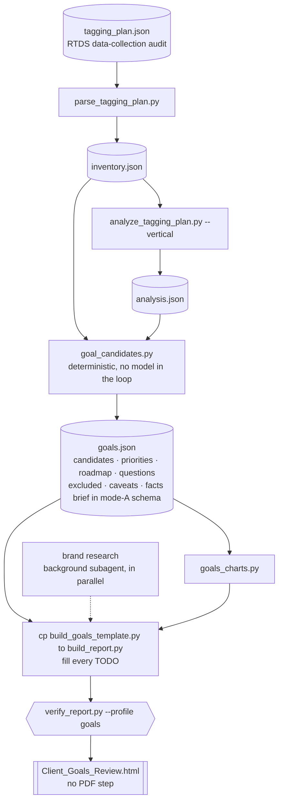

# Mode B — Goals review (light)

The lighter of the skill's two outputs: a conversion-only review built entirely
offline from the client's tagging plan plus public research on the brand. No
Reports API call, no creatives, no PDF. Read this only once mode B is the chosen
mode — see the mode table at the top of [SKILL.md](SKILL.md).

## Mode B — Goals review (light)

A conversion-only review produced **100% offline** from the client's tagging-plan JSON
plus public research on the brand. No MCP call, no `collect.py`, no creatives, no PDF.

### Who reads it, and what it must do

The reader is **an Airship client team (CSM / AM / PS) about to run a conversation with
the client** — not the client. The deliverable answers one question, and every section
should visibly serve it: **what should this account configure as a Goal now?** Around
that sit what to explicitly **avoid** configuring, and which funnel stages nothing can
measure at all — which is where the commercial argument lives.

Three consequences that shape the whole mode:

- **Configurable, not aspirational.** Every candidate carries the configuration Airship
  would actually need — a count, a frequency over a period, or a threshold on a named
  numeric property — and a stated blocker when the property is missing (§5).
- **Names are not evidence.** On a tagging plan alone, a `validate_step` with 2M
  occurrences could be a checkout step or an onboarding step. Every ambiguous candidate
  carries **a question to put to the client** in `goals.json`; the report prints only the
  questions on **the goals the plan shows** (north star, primaries, diagnostics), because
  those are the ambiguities that have to be resolved before they are switched on. The rest
  stay available for whoever needs them.
- **A hierarchy, not a catalogue.** One north star, a thin layer of primaries by funnel
  stage, secondaries for diagnostics — plus the funnel stages nothing can measure. **Do
  not quote a maximum number of goals per project**: a ceiling exists but moves between
  releases; tell the team to check *Reports > Goals* in the dashboard.

### The rule that governs candidate selection

**No data, no goal.** An Airship predefined event (`purchased`, `added_to_cart`,
`registered_account`, `consumed_content`, `search`…) is NOT available just because Airship
knows the name — the client has to send it. Three families, never mixed:

- **A — collected by the client** (in the JSON, activatable today): custom events, tags
  and tag groups, subscription lists.
- **B — native Airship signals** (absent from the JSON by construction, zero
  instrumentation): channel registration (`first_seen`), notification opt-in, named user
  association, `app_open`, `first_open`, `first_opt_in`, `uninstall`, web session, and the
  NPS score via a Scene survey. They have no section of their own: they compete with
  family A for a place in the plan (§6) and fill the *from native signals* column of the
  funnel-coverage matrix, which is where they earn their keep on a thin account.
- **C — gaps**: an archetype that matters for this brand's vertical but is not tracked.
  Never a candidate: gaps surface as the *not measurable today* column of the coverage
  matrix and as the blind stages of §6. The predefined catalogue serves here as a naming
  standard and as the fuzzy matcher for family A.

Orthogonal to eligibility, each candidate carries **how** to configure it: `count`
(always available), `frequency` over a daily/weekly/monthly period, or a threshold on a
**numeric property** (client-collected, or a native numeric such as *time in app*).

### Workflow



Note what is *not* in that graph: no MCP call, no `collect.py`, no creatives, no doubled
window. Steps 3 to 5 are deterministic scripts, so the only place a model writes anything is
the builder's `TODO`s — which is why the brand research is the one input that cannot be
reconstructed by re-running something.

1. **Locate the tagging plan.** If `work/<client>/data/tagging_plan.json` already exists
   from an earlier full run, reuse it — do not ask again. Otherwise ask for the RTDS
   data-collection audit JSON. Create `work/<client>/goals/`.
2. **Brand research** — background subagent, fast web-capable model, in parallel with
   step 3. Same brief as mode A step 1, plus: business model, what a conversion is worth,
   and where the money is actually made (in-app, in-store, off-app). Save to
   `work/<client>/goals/brand.json`.
3. **Parse the audit** (no API):
   ```bash
   python .cursor/skills/airship-engagement-review/scripts/parse_tagging_plan.py \
       work/<client>/data/tagging_plan.json -o work/<client>/data/inventory.json
   python .cursor/skills/airship-engagement-review/scripts/analyze_tagging_plan.py \
       work/<client>/data/inventory.json --vertical "<vertical>" \
       -o work/<client>/data/analysis.json
   ```
4. **Build the candidates** — deterministic, no model in the loop:
   ```bash
   python .cursor/skills/airship-engagement-review/scripts/goal_candidates.py \
       work/<client>/data/inventory.json work/<client>/data/analysis.json \
       work/<client>/goals/brand.json \
       --vertical "<vertical>" -o work/<client>/goals/goals.json
   ```
   **The third positional is a path to `brand.json`, not the brand's name.** It is read
   with `os.path.isfile`, so a name lands as `brand = None` and the whole of step 2 is
   discarded in silence — the engine falls back to the tagging-plan's inferred vertical and
   prints nothing to say it did. The fields you lose that way are the ones no script can
   recover: `not_applicable_archetypes` and `not_applicable_attributes`, which are what stop
   the roadmap recommending a purchase event to a business that has no purchase.
   The tell that the file was read is **`context.brand_sources` being non-empty** in
   `goals.json`. Do not read `context.vertical_source` for this: `--vertical` is applied on
   top of `brand` whether or not a brand file was loaded, so that field reports `brand.json`
   on a run that never opened one.
   `goals.json` carries `candidates`, `priorities` (north star / primary by stage /
   secondary / blind stages / coverage), `roadmap` (the vertical archetypes nothing
   tracks — read by the coverage matrix, not a section of its own), `attributes`,
   `questions` (every ambiguous candidate; the report prints those on the proposed goals),
   `excluded`, the product limits, the goal reports, the caveats, and a `facts` brief in
   the same schema as mode A's `facts.json` (so the gate's KPI-coherence check applies).
5. **Charts** — reusable module, nothing to copy:
   ```bash
   python .cursor/skills/airship-engagement-review/scripts/goals_charts.py \
       work/<client>/goals/goals.json
   ```
6. **Scaffold the builder** and fill the prose:
   ```bash
   cp .cursor/skills/airship-engagement-review/scripts/build_goals_template.py \
      work/<client>/goals/build_report.py
   ```
   The tables, the priority board and the charts are already wired. What you write is
   every `TODO`: the brand reading, the verdicts, the sequencing, the six recommendation
   items. Write them for the Airship team, naming the brand and the act — never "consider
   configuring goals".
7. **Build + gate**:
   ```bash
   python work/<client>/goals/build_report.py
   python .cursor/skills/airship-engagement-review/scripts/verify_report.py \
       --profile goals work/<client>/goals/goals_review.html
   ```
   **There is no PDF step.** No `--print-to-pdf`, and the sidebar download button is
   suppressed under this profile. The HTML is the deliverable: `write_report(...,
   client=CLIENT)` copies it to `~/Downloads/<Client>_Goals_Review_<YYYY-MM-DD>.html`
   once the gate passes, so it is never dug out of the git-ignored `work/` tree.

### Report structure (12 sections)

`cover` · 1 brand & conversion context · 2 data foundation · 3 executive summary ·
4 goal candidates · 5 how to configure each goal · 6 the goal plan ·
7 attributes as future goals · 8 recommendations & questions ·
9 appendix (goal mechanics, method, limits) · 10 data appendix — events ·
11 data appendix — attributes, tags & lists.

The spine lives in `canonical_sections.GOALS_SECTIONS`; the gate reads the same list.

### Language

**English only.** Do not ask the user which language they want, do not emit `-fr` section
ids, and do not add a language toggle — `fw.assemble(pages, None, …)` is monolingual, and
the gate's localisation lint is switched off under `--profile goals` because there is no
translated block for a string to leak into. The one exception is matching, not writing:
the predefined catalogue keeps FR aliases so a French client's `achat_valide` still
resolves to `purchased`.

### The limit to state, not hide

The tagging-plan export counts **occurrences, not unique channels**. Mode B therefore
cannot compute a per-user frequency or a penetration rate, and must not imply one. Say it
in the exec summary and in the appendix — and use it: configuring the goal is exactly what
unlocks the *Channels per goal* and *Goal frequency per channel* reports.
