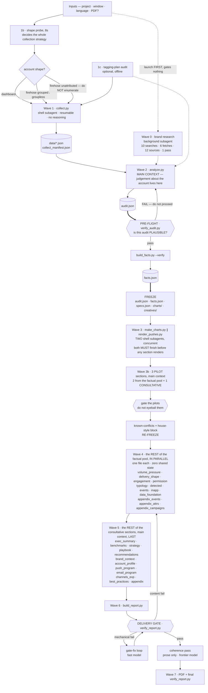
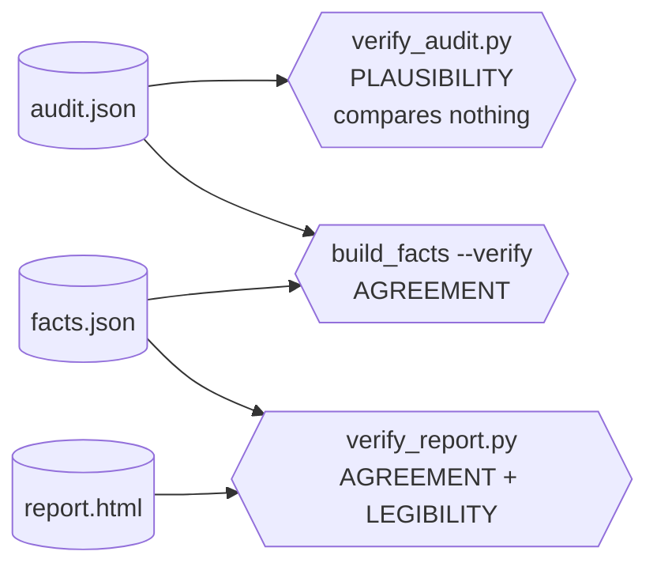

# Orchestration — waves, model routing, and the rules that keep a parallel run honest

How to run an engagement review as **waves of subagents** instead of one long sequential
pass, without losing the property that makes the report trustworthy: that it reads as
though one person wrote it from one set of numbers.

Read this once you know the account (steps 1–3 of the SKILL.md workflow). Parallelism buys
nothing before the data exists, and costs a lot if the data is still moving.

Everything here describes **mode A**, the full engagement review, until the
[Mode B](#mode-b--the-goals-review-in-waves) section near the end.

---

## The one-paragraph version

Collect and analyse **sequentially** — those steps have real dependencies and the numbers
must settle. Check the audit is **plausible** before anything is frozen against it. Then
**freeze**, write **three pilot sections yourself** to find what wave 4 would otherwise hit
ten times, write the ten factual sections **in parallel** against a shared numeric brief,
write the consultative sections **last and together** in the main context (they need the
deep-dives in front of them), and finish with a **prose-only coherence pass**. The gate runs
at the end, as it always did, plus one new check that every KPI card agrees with the brief.

---

## Wave graph



The three hexagons are the only places the flow goes backwards, and the cost of a backward
edge grows sharply the further down you are when you take it: the pre-flight sends you back to
one script, the pilot gate to three sections, the delivery gate to as many as twenty-four.
That gradient is the whole reason the pre-flight and the pilot wave exist — they buy the
cheap failures early, at the price of a few seconds and three sections.

Waves 3b, 4 and 5 partition **one** pool — `CANONICAL_SECTIONS` in
[canonical_sections.py](scripts/canonical_sections.py), the same list the gate enforces —
which is why waves 4 and 5 are written as "the rest". The pilots are not extra work taken on
top; they are two factual sections and one consultative one written early, wherever the
account's traps are most likely to show. `cover` is the twenty-fifth key and appears in no
wave: the builder scaffold emits it.

Which of those keys you can safely leave unwritten is decided by `optional`, and the two
cases behave in opposite ways. A mandatory section is always emitted: hand it no body and the
framework substitutes its own `na_en` block, so a wave-4 section that quietly failed shows up
in the report as "N/A (reason)" rather than as a hole. An optional one is simply skipped when
no renderer is supplied — that is the point of demoting it — so `data_foundation`,
`appendix_events`, `appendix_attrs` and `appendix_campaigns` disappear without trace on a run
with no tagging plan, and `email_program` on a project with no email. Do not read a missing
optional section as a bug, and do not read an N/A block as one either until you have checked
whether the renderer returned nothing or the account genuinely has nothing.

**Why the split at wave 4/5 and not elsewhere.** The parallelised sections are *anchored*:
each one reads a slice of `audit.json`, reports what is there, and reaches a verdict about
its own subject. Nothing about `engagement` depends on how `permission` was phrased. The
wave-5 sections are the opposite — they are the report's argument. `exec_summary` has to
know what the deep-dives concluded, `recommendations` has to not contradict the pressure
analysis, `strategy` has to build on the benchmark reading. Writing those in parallel is
how you get a report that says "reduce cadence" in §4 and "increase cadence" in §16.

---

## Wave 0 — what brand research is allowed to cost

Wave 0 gates nothing, which is exactly why it needs a ceiling: a step on nobody's critical
path is a step nobody notices growing. `airship-brand-research` runs to a fixed budget —
**10 web searches, 6 page fetches, 12 sources, one pass** — filling the fixed `brand.json`
schema in [its agent file](../../agents/airship-brand-research.md) and stopping there.

The budget is derived from consumption, not from taste. On a mode A run **no script reads
`brand.json`** and no gate check inspects it: the whole of it is authoring input for §1,
the 3–4 priority cards in §3c, the brand-adapted column of §7b and the rewritten
new-campaign proposals in §16. Four sections and a handful of tagged sentences. An
unbounded brief spends a frontier-adjacent web model on paragraphs that no reader and no
check will ever see, and it does it in the background where the cost never appears next to
the wave that caused it.

Two places where "gates nothing" stops being true, and where the ceiling is what saves you:

- **A short-collection account.** The ordering note assumes brand research hides inside a
  ~1 hour collection. A `dashboard`-shape account collects in minutes, and then wave 0 *is*
  the critical path — the freeze cannot happen until the industry is confirmed.
- **Mode B.** There is no collection at all. Wave 1 is seconds of Python, so brand research
  is the longest thing in the run by a wide margin.

**If a section needs a brand fact the schema does not carry**, add the field and re-run the
one agent against it. Do not respond by widening the brief, and do not let a run
re-research something already in `brand.json` — that file is part of the freeze like any
other artefact.

---

## The freeze

Before wave 4 starts, these are **read-only** for every subagent:

- [ ] `verify_audit.py` passes on `audit.json`. This runs **first**, because everything
      below is frozen against it — freezing an implausible audit is how you get fifteen
      sections that each need re-reading. See [the pre-flight](#the-pre-flight) below.
- [ ] `audit.json` — final. If a number changes after this point, every section that
      already quoted it is stale and you have no way to know which.
- [ ] `facts.json` — regenerated from the final `audit.json`
      (`python scripts/build_facts.py work/<client>/audit.json`).
- [ ] `specs.json` + `charts/` — `make_charts.py` has run. A section calling `fw.chart()`
      for a chart that does not exist yet raises `MissingChartError` and the subagent will
      "fix" it by dropping the chart.
- [ ] `creatives/` — `render_pushes.py` has run.
- [ ] The section list and their canonical keys are decided, including which are N/A and
      why (record the reasons in `facts.json` via `build_facts(..., na={...})`).
- [ ] The **known-conflicts and house-style block** is written, from what the pilot sections
      turned up. It goes verbatim into every wave-4 brief — otherwise ten agents each pay
      for the same discovery and phrase it ten ways. See
      [carry the conflicts you already resolved](#carry-the-conflicts-you-already-resolved-into-the-brief).

Dispatch those two — `make_charts.py` and `render_pushes.py` — as **two concurrent shell
subagents, not one**. Their outputs are disjoint (`charts/` + `specs.json` against
`creatives/` + `creatives.json`) and both read only frozen inputs, so wave 3 costs the slower
of the two rather than their sum. Nothing downstream can begin until both finish either way,
which is what makes the sequencing pure loss. No run manifest records wave 3 on its own, so
treat this as removing an ordering that buys nothing rather than as a measured saving.

If you must change `audit.json` after the freeze: re-run `build_facts.py`, then re-run the
gate. The numeric check will tell you which sections went stale.

**The gate now tells you when the freeze broke.** `Sections newer than the frozen
audit.json` compares mtimes and lists every section last written *before* the last edit to
`audit.json`. It is advisory — a no-op re-run of `analyze.py` still touches the file — but
when it fires with a long list, those sections quoted a base that has since moved and each
one needs re-reading. On the parallel run this file documents it fired on 13 of 24 sections, which is exactly
how many had to be re-verified by hand afterwards.

Treat a long stale list as a **stop**, not a warning. Re-reading thirteen sections against
a new base costs more than the parallel wave saved.

**What the main context still holds after the freeze, and what it drops.** The freeze exists
so the facts stop moving; it is also the moment the main context should get small, because
everything after it is either delegated or cross-sectional. One run compacted twice, at 96%
and 94%, still carrying `analyze.py`'s output, the chart specs, the rendered creatives, two
pilot sections and 45 KB of `brand.json` — none of which it needed again.

After the freeze the main context keeps exactly two things: the frozen numbers, reached
through `_shared` rather than by reading `audit.json` again, and the briefs it is about to
dispatch. Everything else is on disk and a subagent's job to read. In particular **read
`brand.json` by key, never whole** — a section needs the monetisation block or the
seasonality block, and loading the file to get one of them puts the other fifteen in context
for the rest of the run.

The test for anything you are about to read in the main context: *will a subagent read this
same file anyway?* If yes, let it, and put the one number you needed into `facts.json`.

### The pre-flight

```
python scripts/verify_audit.py work/<client>/audit.json
```

Run it between wave 2 and the freeze, next to `build_facts.py --verify`. It takes under a
second, and it is the only step in the whole run that asks whether the audit is
**plausible** rather than whether two artefacts *agree*.

That gap is why it exists. `build_facts --verify` compares facts to audit; the gate
compares the report to facts. Both are agreement checks, so an audit that is internally
consistent and wrong sails through every one of them and is caught, if at all, by a human
reading §14 several hours later. On the run that motivated this file, three defects did
exactly that — a benchmark with no band, a volume-weighted mix silently zeroed, and
marketing pressure computed from all-channel volume — and each was detectable from
`audit.json` alone before a single chart existed.



Read the diagram by what each check has an *arrow from*. Two inputs means the check can only
ever say "these two disagree". One input means it is judging the artefact itself, and that is
the only place a wrong-but-consistent audit can be caught.

The four checks and what they cost when skipped:

| Check | Skipped, it costs you |
|---|---|
| Benchmarks are bands, not points | Gauges that plot a point against a point; §8's whole comparison is decorative |
| Volume-weighted fields are wired up | A silent zero beside a count-weighted figure that points the other way and reads as a finding |
| Pressure is computed from push-only volume | Pressure overstated by the size of the email programme — 29% on a real account |
| Run identity resolves | Every Flight Deck link absent with no error, or a report that never states its own window |

**A FAIL is a stop, not a note.** Fix `analyze.py` and re-run. The failure modes it catches
are all of the kind that look plausible in isolation, which is precisely why they survive
to wave 5 — so the cheap moment to act is before anything is frozen against them.

### Numbers a section may not invent

A section renders numbers, it does not decide them. Anything a reader could mistake for a
measurement must come from `audit.json` or `facts.json` — never a literal in the renderer.
The failure this prevents is subtle: a hand-picked `"coverage_pct": 45` sits in the same
visual register as a computed one, so the reader cannot tell an assessor's judgement from a
derived figure, and two sections drift apart with nothing to catch it.

If a section genuinely needs an editorial rating, derive it from the model that owns it
(`purpose.maturity` for pillar coverage) or label it in the copy as an assessment. On the
same run the same pillar was published at 43%, 45% and 60% by three sections; only the
first was computed.

### Sentences a section may not copy

The twin of the rule above, and it has cost more. **Every string in `audit.json` is
internal working English.** Fields like `*_reading`, `*_note`, `verdict`, `reason`,
`publish_instead` and `*_reason` are written to brief the agent reading the audit; none of
them is client copy. A section that renders one ships English prose into a translated
report — twenty such fields in one French review, each found at wave 6, when translating
them was no longer a five-minute job.

Worse, a sentence typed next to the number it describes drifts from it. One audit carried
`total_direct_responses: 96` beside a sentence reading "95 direct responses in total"; six
sections copied the sentence, the summary read the field, and the report shipped both
numbers. Another asserted a rate ran "below p10" when p10 was 0.9% and the rate was 1.38%,
and that claim reached two sections before anyone checked it against the band sitting three
keys away.

So: **read the audit's numbers, write your own sentence.** If the audit states a position
against a band, re-derive it from the band rather than repeating the claim — and if the two
disagree, that is a finding to report, not to smooth over. The one sanctioned exception is
an explicit `*_en` / `*_fr` pair, which is pre-translated copy and is meant to be rendered.

`check_section.py --lang <lang>` now refuses the English leak directly, so this is caught
when the section is written rather than at the gate.

### Wave 3b — the pilot sections

Write **three sections yourself, in the main context**, before delegating anything. Their
purpose is not the three sections; it is to discover what wave 4 is about to hit ten times.

Every trap that a parallel wave multiplies is cheapest to find here: an audit key that is
not shaped the way the section needs it, a helper that behaves unexpectedly, a conflict in
the data that needs one settled reading. Found in a pilot, each costs one fix. Found in
wave 4, each costs ten agents' worth of context and produces ten phrasings.

Two rules, both learned by getting them wrong:

**One of the three must be consultative.** All three pilots on the motivating run were
factual, so every failure specific to consultative markup survived to the end — the
recommendation-item counting, undefined CSS classes, a contaminated delta published without
naming its cause — and surfaced together as a twelve-failure gate loop at the point in the
run where fixing anything is most expensive. Factual and consultative sections use
different parts of the framework, so piloting only one kind tests only half of it.

**Gate the pilots. Do not eyeball them.** Build and run `verify_report.py` on the
three-section report:

```bash
python work/<client>/build_report.py --no-gate
python .cursor/skills/airship-engagement-review/scripts/verify_report.py work/<client>/report.html
```

Most checks will fail for the honest reason that the other twenty-one sections do not exist
yet — ignore those. What you are reading for is the *per-section* complaints: a missing
`grid` class, a computed KPI with no `formula=`, a double-escaped entity, an undefined CSS
class, an illegible KPI. Every one of those is a mistake ten agents are otherwise about to
make in parallel, and reading them here converts a wave-6 fix loop into three lines in the
brief.

Then write the known-conflicts block from what the pilots turned up, and **re-freeze**.

### Carry the conflicts you already resolved into the brief

A frozen brief stops sections from *disagreeing*. It does nothing to stop them from each
paying, separately, for the same discovery — and in a parallel wave that cost is multiplied
by ten rather than amortised.

Two examples from one run. An apparent contradiction in the opt-in data (tens of thousands
of reachable browsers against a channel the audit reports as zero) was found and reasoned
about independently by **three** section agents, who each arrived at roughly the right
reading and each phrased it differently. Separately, three agents each hit the same library
formatting defect and each worked around it locally. Six investigations, two findings, and
inconsistent wording as the by-product.

Neither was a failure of the agents. Both were the orchestrator withholding something it
already knew. So: **after the pilot sections, write down every conflict you resolved and
every convention you settled, and paste it verbatim into all ten wave-4 briefs.** Two lines
per conflict. That converts consistent handling from a lucky outcome into a structural one,
and it is the cheapest item in this whole document.

The rule that makes it work: a section that meets a conflict *not* on the list must report
it rather than resolve it locally. A local resolution is invisible to the other nine, which
is exactly how the same figure gets three phrasings.

---

## What each subagent gets, and what it must never get

| | |
|---|---|
| **Always** | `facts.json` (all of it — it is small on purpose) |
| **Always** | its own slice of `audit.json`, named explicitly |
| **Always** | the chart ids it may embed, and the fact that they already exist |
| **Always** | the `reference.md` headings its metric needs, **named** — never "section *n*" |
| **Never** | `data/*.json` — megabytes of raw API rows that only `analyze.py` needed |
| **Never** | the rest of `reference.md` — the endpoint tables, the i18n contract, the scaffold |
| **Never** | another section's draft — they are independent by construction |
| **Never** | permission to edit `audit.json`, `facts.json`, `specs.json` or another section's file |

The "never `data/*.json`" rule is the one that actually saves money. A section agent that
loads a firehose account's raw pushes has spent more context on rows it will not cite than on the
section it was asked to write.

`reference.md` is the same mistake in a form that looks legitimate, because the brief does
tell the agent to read it. The file is **~24 000 tokens** and it is one file, so "the
section on your metric's semantics" is an instruction an agent can only follow by reading
all of it — and twelve agents each doing that is **~286 000 tokens to deliver ~28 000 of
actual semantics**. Measured per section, the slice each one needs is 3–19% of the file:
`inapp` needs 800 tokens, `appendix_campaigns` the most at 4 600. The endpoint tables alone
are 3 700 tokens that no wave-4 agent can cite, because wave 4 may not touch the API.

So the brief **names the headings**, and `reference.md` opens with the table that maps a
canonical key to them. An agent whose section is missing from that table reports it rather
than falling back to reading everything — otherwise the saving quietly decays back to a
whole-file read, one section at a time.

### How many at once: two or three, not ten — in EVERY wave

"Fan out the whole wave" is the wrong mental model, and finding that out mid-run is expensive
because the failures arrive as `[resource_exhausted]` on agents that were *dispatched* — the
work is not queued, it is refused, and the orchestrator has to notice and re-dispatch each one.
Measured across two multi-section runs, the practical ceiling for local subagents was **two to
three concurrent**, far below any documented cap.

So dispatch in batches of two or three and wait for each batch. This is not much slower than
the imagined ten-wide fan-out — those ten were never running at once anyway — and it makes the
wave legible: each batch either lands or fails visibly, instead of a silent shortfall you
discover when the build reports four missing sections.

**This applies to every wave, and the one that breaks it is wave 0.** The rule lived here as a
wave-4 paragraph for three runs, so a fourth read it as a wave-4 rule and fanned brand research
ten wide: around twenty agents in a four-minute burst, six of them dead in under five seconds
with exactly the `[resource_exhausted]` signature described above, to produce one `brand.json`.
Wave 0 is **one agent** — see `scripts/brand_schema.json`, which freezes its output shape so
there is nothing to fan out across in the first place. Wave 3 is shell work. Wave 5 and the
coherence pass are cross-sectional and stay in the main context. Wave 4 is the only wave whose
whole point is parallelism, and even there the ceiling is three.

### Four pairs that belong to one agent

"One agent per section file" is the default, not a law. Four pairs read the *same slice of
`audit.json`* and reach verdicts that have to agree with each other, so splitting them buys
nothing and costs a reconciliation:

| Pair | Why one agent | Sections |
|---|---|---|
| `data_foundation` + `detected` | both answer "what can this account actually measure" — coverage of the tracking plan, and how reliably a campaign can be identified at all | §2b + §7c |
| `appendix_campaigns` + `appendix_attrs` | two views of one inventory; the counts in each must foot to the same totals | §20 + §19 |
| `brand_context` + `account_profile` | the business and the configuration built for it; the second is only readable against the first | §1 + §2 |
| `playbook` + `best_practices` | one grades what the account sends, the other grades how it sends it, off the same campaign list | §7b + §15b |

Written as pairs, the eight sections cost four dispatches rather than eight — which fits the
two-or-three ceiling above in two batches instead of three, and removes the most common source
of coherence-pass work, two agents describing the same rows with different totals.

The pairing is about shared *input*, not about length. Do not pair two sections merely because
both are short: an agent given two unrelated slices carries both in context and writes each one
worse than a dedicated agent would.

### Wave 4 must actually be delegated, and the manifest says whether it was

This is not a style preference. Two completed accounts wrote **19 and 24 section files in the
main context and compacted five times each** — the auto-log records twelve compactions across
four accounts and, until the mechanism was verified, not one delegated wave. The hook was
right all along; the delegation simply never happened, and an absent row looked identical to
a missing logger.

So it is now counted. `log_wave.py` runs on `stop`, compares the section files on disk against
the `subagentStop` rows in the manifest, and writes the verdict into `run.md`:

```
| 11:19 | stop | 19 section file(s), 0 delegated wave(s), 5 compaction(s) — WAVE 4 WAS NOT DELEGATED: every section was written in the main context, which is what fills it |
```

**What the main context may carry, and what it may not:**

| | |
|---|---|
| **Never** reads `data/*.json` itself | that is `analyze.py`'s job, and its output is `audit.json` |
| **Never** re-reads a data file after a compaction | if it was needed twice it belonged in `facts.json` or the brief |
| **Never** writes a wave-4 section | one `airship-section` per file, dispatched in parallel |
| **Always** freezes the numbers before dispatching | a brief that can move produces sections that contradict each other |
| **Keeps** waves 2, 5 and the coherence pass | they are cross-sectional and cannot be split |

The rule that follows from the count: if a wave-4 dispatch would need the main context to read
a data file to write the prompt, the number is missing from `facts.json` — add it there instead.
A brief is cheap; carrying a megabyte of rows through five compactions is not.

### Which sections may be delegated at all

A wave-4 section is delegable because it is *anchored*: it reads its slice, reports what is
there, and its verdict is about its own subject. Two kinds of section are not, whatever wave
they nominally belong to:

- **Anything that reaches a verdict about the data itself.** The methodology appendix is the
  case that proved it. It was dispatched as a factual section, and it shipped a claim the run
  had already disproved — because the agent wrote it against the brief as frozen, while the
  correction lived in the main context's own reading of the account. An appendix that says
  "this counter was rejected" is only as good as the most recent thing known about the
  counter, and that knowledge does not survive a freeze.
- **Anything the coherence pass would have to rewrite anyway** — the wave-5 argument sections.

The test is not "is this section factual" but "could this section's verdict change because of
something learned while writing another section". If yes, it stays in the main context.

---

## Two apps of one brand, in one run

Asked for often enough to stop improvising: a broadcaster with a news app and a streaming
app, a retailer with a shopping app and a loyalty app. It is **two reviews, not one** —
each app gets its own work directory, its own audit, its own freeze and its own report.
What is shared is the brand research, the benchmark resolution, and one section.

```
work/<app_a>/    audit.json  facts.json  specs.json  charts/  sections/  → report A
work/<app_b>/    audit.json  facts.json  specs.json  charts/  sections/  → report B
work/_shared/    BRIEF.md  brand_research.md  cross.json
```

Run waves 1–2 per app, to completion, before anything cross-app exists. Then:

```bash
python scripts/cross_compare.py work/app_a/audit.json work/app_b/audit.json \
    --label "App A" --label "App B" -o work/_shared/cross.json --freeze
```

`cross.json` is frozen with the rest of wave 2 and is the **only** source §3d
(`cross_app`) may read. It aligns the two audits on `build_facts` KPI keys, so every
figure in the comparison is the one that app's own report publishes and the two reports
cannot disagree about the same pair of numbers. It also refuses, which is most of its
value: mismatched windows exit 1, a metric measured on one side only is marked
not-comparable rather than shown as a gap to zero, a value in either audit's
`contaminated_fields` is dropped, and every row says whether it may be read as
*performance* or only as *numbers*. Two apps of one brand often sit in different
benchmark cohorts, and then neither app is the other's benchmark.

Both reports carry the same §3d, written from the same file, with the perspective
reversed. The section is `optional=True, gate_required=False` in the spine, so a
single-app run is unaffected.

**One deliverable pack, not two.** When the run also produces NotebookLM sources, build a
pack per app and merge them:

```bash
python scripts/merge_source_packs.py ~/Downloads/A_Source_Pack ~/Downloads/B_Source_Pack \
    -o ~/Downloads/Brand_Source_Pack_<date>
```

Sources identical across the apps — the reference tiers — are emitted once; everything
else keeps its numeric prefix and gains an account suffix, so the same theme sorts
adjacently for the two apps. Add each report's markdown to its own pack **before**
merging, and delete the single-app packs afterwards so only one is delivered.

---

## Model routing

**Declared in `.cursor/agents/`, not chosen per run.** Delegate to the agent and its model
comes with it:

| Wave | Agent | Model |
|---|---|---|
| 0 brand research (background) | `airship-brand-research` | `gpt-5.6-sol` |
| 1, 3, 7 scripts | `airship-shell` | `composer-2.5[fast=true]` |
| 4 factual sections | `airship-section` | `claude-opus-5[effort=high]` |
| 4 data appendices | `airship-appendix` | `composer-2.5[fast=true]` |
| 6 gate-fix loop | `airship-gate-fix` | `composer-2.5[fast=true]` |
| 2, 5, coherence pass | main context | frontier |

The prompts these agents carry are the ones that used to live in *Prompt templates* below;
that section is now a reference for what each agent is told, not something to copy per run.

`.cursor/hooks/guard_model.py` denies an `airship-section` launched on a Composer model, and
records the model that actually ran in `work/<client>/run.md` — a declared model is not always
the model you get.

---

## Prompt templates

### Wave 1 — collection (`shell`)

```
Run, from the repo root, and report the tail of the output plus the contents of
work/<client>/data/collect_manifest.json:

python .cursor/skills/airship-engagement-review/scripts/collect.py "<MCP project>" \
  --start <YYYY-MM-DD> --end <YYYY-MM-DD> --out work/<client>/data [--shape <shape>]

Do not edit any file. If a stage reports status FAILED, say which and stop.
If a stage reports status `partial`, report its `truncated` list verbatim — it hit the
soft per-stage deadline and wrote what it had rather than being killed. Do NOT re-run it
with a bigger deadline on your own initiative; partial-but-stated is a valid outcome.
Also report `probe.json`'s `shape_reason`: on a firehose it says whether the grouped/
groupless call was made on push share, sends share or confirmed programme volume, and
that call is the difference between ~2 000 and ~76 000 API calls.
```

### Wave 4 — one factual section

```
Write ONE section of an Airship engagement review: `<canonical_key>` (<section title>).

Write it to: work/<client>/sections/<canonical_key>.py
The filename is the section's **canonical key**, NOT its HTML anchor. Several sections
differ: `volume_pressure` (anchor `pressure`), `benchmarks` (`bench`), `push_program`
(`push`), `brand_context` (`context`), `account_profile` (`adoption`), `data_foundation`
(`foundation`), `appendix` (`method`), `appendix_events` (`appx_events`),
`appendix_attrs` (`appx_attrs`), `appendix_campaigns` (`appx_camps`). If the key you were
given appears in that right-hand column, use the left-hand one and say so in your report.
The file must expose exactly:  def render(ctx, lang): -> str (an HTML fragment)
Raise report_framework.NoData("reason EN", "reason FR") if the data genuinely isn't there.
Do not create, rename or delete any other file.

READ:
  - work/<client>/sections/_shared.py       (import from it; it carries the house rules)
  - work/<client>/facts.json                (the shared numeric brief — quote THESE numbers)
  - work/<client>/audit.json, keys: <explicit list of keys this section owns>
  - .cursor/skills/airship-engagement-review/reference.md — ONLY the headings listed for
    your canonical key in that file's opening slice table (<name them here>), read with
    an offset and a limit. Not the whole file: it is ~24 000 tokens and you need 3-19%.

DO NOT read work/<client>/data/*.json — not at write time, and not at render time either.
Those are raw pulls, retired the moment the delivery gate passes. A section that opens one
renders correctly today and cannot be rebuilt tomorrow: not after a framework fix, not to
produce the other language. Two reviews shipped this, and a third lost the section outright
when a purge ran during the build. If the figure you need is not in audit.json, say so in
your reply — the fix is for analyze.py to put it there, never for you to reach into data/.

Charts you may embed (they already exist, do not regenerate):  <chart ids>
Language: <en|fr> — the deliverable ships ONE language. Still branch on `lang` rather
than hardcoding strings: it costs nothing and keeps the section reusable if a client
later asks for the other language or for both.

KNOWN CONFLICTS in this account's data — already investigated, settled, do not re-derive:
  - <the figure> conflicts with <the other figure>. The reading is <X>. Say it as <phrasing>.
  (Copy this list verbatim into every wave-4 brief. If you hit a conflict that is NOT
   listed, report it in your reply rather than resolving it locally — it belongs here.)

HOUSE STYLE settled for this run:
  - <e.g. counts via _shared.i(), rates via _shared.n() — never fmt_num on a count>
  - <e.g. a channel labelled "push" means push only; the all-channel total is named so>
  - <e.g. absence found in decoded bodies is "none found", never a metered "0">
  - <any library quirk already worked around, so ten agents do not each rediscover it>

TERMINOLOGY LOCK — one canonical label per metric, and these are not negotiable per
section. Filling this in costs a minute and settles an argument the coherence pass would
otherwise have to find: on one run §5 called in-app activity "impressions" while §8b
documented, correctly, that the impressions field is dead and the number is CTA
interactions. Both sections were internally consistent; the report was not.
  - <metric> is always called "<label>", never "<the tempting wrong one>"
  - <e.g. in-app: "interactions" (CTA events). `app.in_app.impressions` is a dead field>

CROSS-REFERENCES: use `_shared.ref("<canonical_key>")`, never a `§n` you typed yourself.
`ref("strategy")` renders `§3c`, `ref("engagement")` renders `§5`. You cannot see the
assembled numbering from here and the canonical slots are not the order the report reads
in, so a hand-written number is a guess. On one review, sections written in parallel
produced 31 wrong cross-references: 22 saying `§5` for the section that ships as `§3c`,
and nine pointing at numbers no section carries. The gate now fails on the second kind;
`ref()` is what prevents the first.

QUOTING THE ACCOUNT: anything copied verbatim out of the client's data — a campaign name,
a template token, an event property, a payload key — goes through `_shared.esc()`. Your
section body is raw HTML, so `MobilePush_<Theme>_KW<week>` loses its angle brackets and
ships as `MobilePush_ _KW _`. That is not a `note()` rule; it applies wherever the string
lands.

KNOWN QUIRKS of the shared libraries — worked around already, do not rediscover:
  - `note(kind=…)` takes note-up / note-warn / note-bad. There is no `note-info`.
  - `opportunity.py` emits its `formula=` strings in English and in US number format;
    rewrite them for a non-English deliverable rather than passing them through.
  - `opportunity.size_pressure_headroom` computes a distance to the peer median. The
    median is NOT a target: never render it as "send X more" — one draft recommended
    sending 2.8M additional messages to an account already above the band.

Requirements:
  - Use `_shared.py` rather than re-deriving its helpers: `kpi()` (raises instead of
    returning a silent zero), `i()` for counts and `n()` for rates, `signal_table()`
    (escapes its own cells), `flight_deck()`, `contamination_note()`, `money()`. If one
    is missing what you need, say so in your reply — do not write a local variant, since
    nine other sections are relying on the shared one behaving one way.
  - facts.json `withheld` lists figures THE COLLECTION ITSELF DISQUALIFIED. Never publish
    one as a number. Each entry carries the value it disqualifies (so you recognise the
    figure you were about to quote), the reason, and what to say instead — often the
    coverage, or a trend rather than a mean. Saying "not measurable, here is why" is a
    finding; publishing a precise number drawn from 1% of the volume is not.
  - Every computed KPI goes through ri.kpi_card(..., formula=...) — the gate rejects a
    computed KPI with no methodology.
  - Every data table is <table class="grid">.
  - Pass PLAIN TEXT to helpers that escape their own input; entities only in note()/verdict().
  - Close with a verdict or note: what the reader should conclude, not just what the number is.
  - If you need a number that is not in facts.json and not in your audit slice, say so in
    your reply instead of inventing or re-deriving it.
  - Anything you quote from audit.json prose is INTERNAL WORKING ENGLISH — a briefing
    note, never client copy. Read its numbers and write your own sentence in the
    deliverable's language. The one exception is an explicit `*_en` / `*_fr` pair.

BEFORE YOU HAND BACK, run:
    python .cursor/skills/airship-engagement-review/scripts/check_section.py \
        work/<client> <canonical_key> --lang <en|fr>
It renders your file alone — a sibling's syntax error cannot fail it — and applies the
gate's own checks to it: English leaks and English decimal marks in a translated section,
unformatted f-strings, leftover TODO, undefined CSS classes, KPI cards with no formula,
values the audit disqualified, and reads of data/. Exit 0 or say in your reply what you
could not fix and why. This is not optional: twelve agents in a row skipped it on one run
and the gate found the same English prose in twelve sections at wave 6, hours later.
```

### Wave 6 — gate-fix loop (fast model)

```
Run:  python .cursor/skills/airship-engagement-review/scripts/verify_report.py work/<client>/report.html

For each ✗, apply the fix named in the message, then re-run until it passes or you are
blocked. These are the mechanical ones and are yours to fix:
  missing `grid` class · missing formula= · double-escaped entity · missing French accent ·
  undefined CSS class · orphan methodology button · empty  src ·
  an unformatted f-string under "No template text"

STOP and hand back if the ✗ is: a missing canonical section, a missing chart or creative,
a thin section, insufficient recommendation depth, "KPI values agree with facts.json",
a TODO under "No template text" (a section was never written — the scaffold stub is what
shipped), or "Charts do not re-publish a withheld metric" (the chart has to lose the
argument or be relabelled, which is a content call).
Those are content problems, not formatting ones. Never edit audit.json or facts.json.
Never pass --no-gate.
```

### Wave 6 — coherence pass (frontier)

**Do not treat the gate as a substitute for this.** The gate's only cross-section check,
`_facts_coherence`, compares a KPI *card* whose label matches a `facts.json` KPI exactly;
`_gauge_verdicts` compares a gauge's worded verdict to its own band. Everything else a
section asserts — a claim in prose, a percentage computed inline inside a finding card, a
cell in a comparison table, a benchmark reading — is invisible to it. On that run
eight of the nine blocking findings were outside what any automated check could see.

```
Read the assembled work/<client>/report.html and work/<client>/facts.json.

You are the last reader before the client. Fix ONLY prose:
  - contradictions between sections (the classic: §4 warns about over-pressure while §16
    recommends more volume)
  - the same number rounded or described differently in two places
  - vocabulary drift (the brand's product names, "opt-in" vs "subscriber", EN/FR terms)
  - repetition — a point made three times reads as padding

You MUST NOT: add or remove a section, change the section order, change a chart, change a
number, or restructure a table. If a number looks wrong, report it — do not correct it.

Edit the section source under work/<client>/sections/, never report.html directly, then
re-run the builder. Reply with the list of changes you made and anything you chose to
leave alone.
```

---

## What the second language cost, measured

Rebuilt one delivered account two ways from the same frozen `audit.json` and the same
`sections/` — no API call, nothing about the analysis changed, only the assembly:

| | bilingual (as delivered) | monolingual (new default) |
|---|---|---|
| deliverable | 6.8 MB | 3.7 MB |
| images | 341 | 171 |
| sections | 25 | 25 |
| content checks | all pass | all pass, identically |

**Same 25 sections, same verdicts, same KPI methodology, 45% smaller.** The second column
was duplication, not depth — and on the authoring side it is worse than these numbers
suggest, because a bilingual run has every section written twice while this rebuild reused
prose that already existed. That is the case for making it opt-in.

The one failure the rebuild surfaced was pre-existing and unrelated: five charts carry
French chrome, which the *one English chart set* check catches in either variant. Worth
fixing in that account's `make_charts.py`, not in the assembly.

---

## What the gate actually rejects

Measured across 13 completed accounts, by re-running `verify_report.py` on the delivered
reports and counting failures per check. Worth knowing before you assume where a slow run
loses its time.

**The bilingual build is the single biggest source of blocking failures** — 10 of 28,
split evenly between `Localisation (no English leftovers in translated blocks)` and
`Charts are one English set`. Nine of the thirteen reports shipped two languages. This is
why mode A now defaults to one language: it deletes the largest class of gate iterations
outright rather than making it cheaper to clear.

**The volume floors almost never fire.** `Recommendations depth` and `Insight density`
each failed once; `Section depth (no thin sections)` failed **zero** times. A floor that
never blocks costs no wall-clock, so cutting it buys no time — the reason to demote it is
different and worth stating plainly: a floor that mandates a count shapes the output
*before* the check runs. Six recommendations get written because six are required, and the
gate then passes with nothing to show that the sixth was padding. That effect is invisible
to this measurement, which is exactly why it needs a human reading the report rather than
a threshold.

**What does fire is structural**: missing canonical sections (3), missing executive-summary
KPI bands (3), unstyled tables (3), KPI without methodology (2), absent creatives (2).
These are correctness and stay blocking.

---

## Run manifest

Kept in `work/<client>/run.md`. It is what makes a parallel run reproducible and a failure
diagnosable — and for twelve accounts running, not one existed, because a manifest that
depends on the orchestrator remembering it mid-run does not get written.

`.cursor/hooks/log_wave.py` now fills the part a hook can see on its own: per-wave duration
and tool-call count on `subagentStop`, context pressure on `preCompact`, and on `stop` the
delegation audit described above. Fill the header and Deviations by hand; the auto-log
accumulates below them.

Verified against a live subagent: the payload carries `subagent_type` and `description`, and a
row appears. If a future payload spells them differently the logger writes the payload's keys
into the manifest rather than dropping the row, so the mismatch is visible instead of reading
as "nothing was delegated".

**Anything you noticed about the SKILL rather than about the account goes in
[work/_internal/lessons.md](../../../work/_internal/lessons.md), at the end of the run.** A
helper that did not exist, a check that fired too late, a false positive you worked around,
a convention you had to invent locally. One run wrote "worth reporting upstream as a
skill-level observation, but not fixed here mid-run" into its own log, and the observation
went nowhere because there was nowhere for it to go; another solved the audit-prose problem
with a convention that worked and three later runs rediscovered the same problem. Read the
file before changing the skill: one account is an accident, three entries saying the same
thing are a design.

```markdown
# <client> — run <date>
project: <MCP project>   window: <start> → <end> (<n> d, prior <start> → <end>)
shape: <dashboard|firehose_grouped|firehose_groupless|firehose_unattributed>   language: <fr|en> (+ secondary)

| wave | task | model | started | done | notes |
|---|---|---|---|---|---|
| 0 | brand research | sol-medium | | | |
| 1 | collect.py | shell | | | manifest: N calls, Ns |
| 2 | analyze + build_facts | frontier | | | K KPI resolved, U unresolved |
| — | FREEZE | | | | audit/facts/specs/charts/creatives |
| 3 | charts + creatives | shell | | | N charts, N creatives |
| 4 | volume_pressure | frontier | | | |
| 4 | … one row per parallel section … | | | | |
| 5 | consultative sections | frontier | | | |
| 6 | gate + fixes | fast | | | ✗ cleared: … |
| 6 | coherence pass | frontier | | | changes: … |
| 7 | PDF + final gate | shell | | | PASS |

## Deviations
- <anything bespoke: a collect_hook, an overridden KPI, a section kept inline>
```

**Deviations is a delivery item, not a courtesy.** It is the only place a run records what it
did differently, and it is the first thing read when the same account is reviewed again or
when a figure is challenged months later. Every run has at least one entry — a run with none
has an unwritten section, not a clean record. Write "none" only after checking the list below,
and treat an empty Deviations block the way you would treat a missing appendix:

- a counter refused, and what was published instead
- a chart dropped, and why the spec was refused
- a KPI overridden, resolved by hand, or left unresolved
- a section kept in the main context that the wave graph says to delegate
- a collection hook, a re-collection, or a window moved after the fact
- an endpoint that answered wrongly, and how it was worked around

The delivery checklist in `SKILL.md` carries this as a line item; the gate cannot check it,
which is exactly why it has to be checked by a person.

---

## Failure modes, and what they look like

| Symptom | Cause | Fix |
|---|---|---|
| Build stops on `SectionLoadError` | file named after the section's HTML anchor (`pressure.py`, `bench.py`, `appx_events.py`) rather than its canonical key | the error now names the exact rename — apply it. Root cause is a dispatch prompt that filled `<canonical_key>` with the anchor |
| A section is silently N/A **and the gate still says PASS** | a `_todo` stub in the builder's `INLINE` dict shadowing a real `sections/<key>.py` | stubs carry `is_placeholder` and lose to a file, so this needs a *non*-stub inline renderer to recur — remove it from `INLINE` |
| `MissingChartError` mid-wave-4 | charts were not built before the wave | wave 3 must complete first; that is why it is its own wave |
| Gate: "KPI values agree with facts.json" | two sections on different bases, or a stale number after a late `audit.json` edit | re-run `build_facts.py`, then fix the section that disagrees — do not "fix" `facts.json` to match the report |
| Gate: "Gauge verdicts match their own band" | a worded verdict was written from memory of the account, not from the band beside it | reword to the position the value holds — the gate prints the value and the band it checked |
| Gate: "Sections newer than the frozen audit.json" | the freeze broke: `analyze.py` was edited after the section wave started | re-read every listed section against the new base; if the list is long, re-freeze and rewrite rather than patch |
| Sections contradict each other | wave 5 written before wave 4, or coherence pass skipped | wave 5 reads the finished deep-dives; never invert the order |
| Two sections publish one metric on two bases | the metric is derived independently in each renderer | derive it once in `analyze.py` under an explicit name (`spum_alerting` vs `pressure.*_month`) and have both sections read that key |
| A subagent burned its context | it was given `data/*.json` | give it `facts.json` + a named audit slice |
| Collection takes ~1 hour, `responses` is ~90% of it | a grouped firehose classified `firehose_groupless`, so it enumerated instead of rolling up | read `probe.json` `shape_reason`. A `group_id` on few *pushes* means nothing when the median push delivers 0 sends; what decides is `confirmed_program_sends`. Re-run that stage with `--shape firehose_grouped` |
| `responses` runs for many minutes and `data/pushes/` stays empty | a dense account with no programme layer was sent to exhaustive enumeration, which cannot be sized: `probe.json` shows `pushes_per_day_exact: false` | that account is `firehose_unattributed`, not `firehose_groupless`. Do not enumerate it — volume from `/api/reports/sends`, inventory from the hour-tiled activity log, typology from a sends-weighted sample. Re-run with `--shape firehose_unattributed` |
| Gate: "Aggregated chart totals agree with facts.json" | a donut or ranked bar summed the DOUBLED window under a current-window title | slice with a `cur()` helper before totalling (see the DOUBLED WINDOW note in `airship_charts.py`); the gate prints the ratio, and ~x2 names the cause |
| A firehose report says coverage is 27% and reads as data loss | `attributed_share` was mistaken for enumeration fidelity | check sends-per-push across days: stable while reported sends move means the descent was complete and the residual is programme volume, which only `pergroup/detail` reports |

---

## Mode B — the Goals review, in waves

The light conversion review (SKILL.md, *Mode B — Goals review*) has a much flatter graph,
for one reason: **there is no collection**. The whole factual base is one JSON file the
client already gave you, and turning it into candidates is deterministic Python. What
remains to orchestrate is research and prose.

```
WAVE 0  brand research (background, fast web-capable) ──► goals/brand.json
           │                                              (runs during wave 1)
           │                                              PASS THAT PATH to goal_candidates.py —
           │                                              a brand NAME there is silently ignored
WAVE 1  parse_tagging_plan → analyze_tagging_plan → goal_candidates → goals_charts
           │                 (shell subagent, no reasoning — pure scripts)
        ══ FREEZE ══  goals.json · charts/ · specs.json
           │
WAVE 2  ┌── factual sections, in parallel ──┐
        │  data_foundation   goal_candidates │
        │  goal_attributes                   │
        │  appendix_events   appendix_attrs  │
        └────────────────────────────────────┘
           │
WAVE 3  consultative sections, main context, LAST:
        brand_context · exec_summary · goal_qualification · goal_plan ·
        recommendations · appendix
           │
WAVE 4  build_report.py ─► gate (--profile goals) ─► fix loop ─► coherence pass
```

**There is no wave for the PDF.** Mode B ships HTML only; `pdf_button=False` and the
profile drops the creatives and localisation checks from the gate.

**The freeze matters more here, not less.** `goals.json` carries the priorities, the
exclusions and the tracking gaps — every wave-3 section argues from them. Re-running
`goal_candidates.py` after a section has quoted a rank silently invalidates it.

**Wave 3 is where the deliverable actually is.** Wave 1 is deterministic and wave 2 is
mostly tables the components already render. What the Airship team pays for is the brand
reading in §1, the north-star verdict and the blind-stage pitch in §6, and the six
recommendation items in §8 — all frontier work, all written after the tables exist. A
mode B run that parallelises wave 3 to go faster is optimising the only part that has to
be coherent.

**Two mode-B-specific failure modes:**

| Symptom | Cause | Fix |
|---|---|---|
| A predefined event appears in the shortlist with no occurrences | it was read as available because Airship knows the name | family A requires the event to be **in the JSON**; unmatched archetypes are gaps, and `goal_candidates.py` already routes them to the coverage matrix in §6 — check the section renderer, not the engine |
| The roadmap recommends an archetype the business cannot have, and §1 reads generically | `goal_candidates.py` was given the brand's **name** in the third positional instead of the path to `brand.json`. `os.path.isfile` fails, `brand` becomes `None`, and wave 0 is discarded without a word | pass `work/<client>/goals/brand.json`. Confirm with non-empty `context.brand_sources` in `goals.json` — **not** `context.vertical_source`, which `--vertical` makes truthy either way |
| The report quotes a maximum number of goals | invented, or copied from an old doc | remove it; state the ceiling exists and point at *Reports > Goals* |

---

## When NOT to parallelise

- **A small account.** Under ~10 sections with real data, the coordination costs more than
  it saves.
- **Any mode B run.** Wave 1 is seconds of Python and the prose has to be coherent; run
  it in one context and use subagents only for the brand research.
- **A first run on an unfamiliar account.** The first pass is where you discover that
  `sends` counts only alerting pushes, or that the group layer is missing. Discover that
  sequentially, in one context. This is the rule that run broke, and the bill was
  legible: ten edits to `analyze.py` after the freeze, 13 stale sections, and seven of the
  nine blocking findings in the coherence pass were contradictions *between* sections
  rather than errors inside one. Section writing took roughly two hours of a two-and-a-half
  hour run — the parallelism saved wall-clock in wave 4 and lost more of it in wave 6.
  A cheap way to keep both: write two or three sections first, throw them away once the
  methodological traps surface, re-freeze, then fan out.
- **Anything after the freeze breaks.** If `audit.json` has to change, stop, fix it,
  re-freeze, and restart wave 4. Parallel work on a moving base is how contradictions ship.
